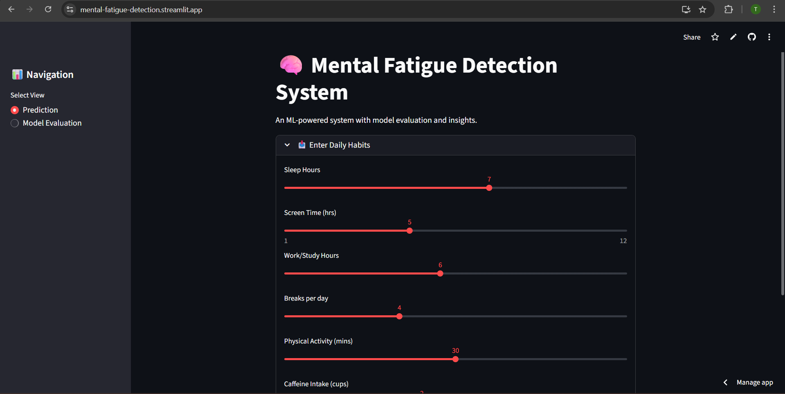
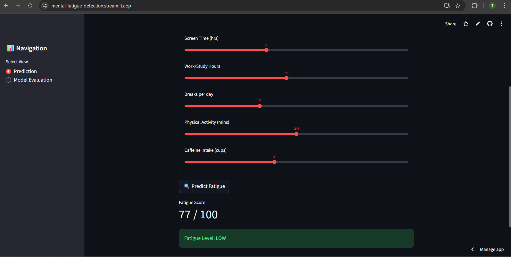
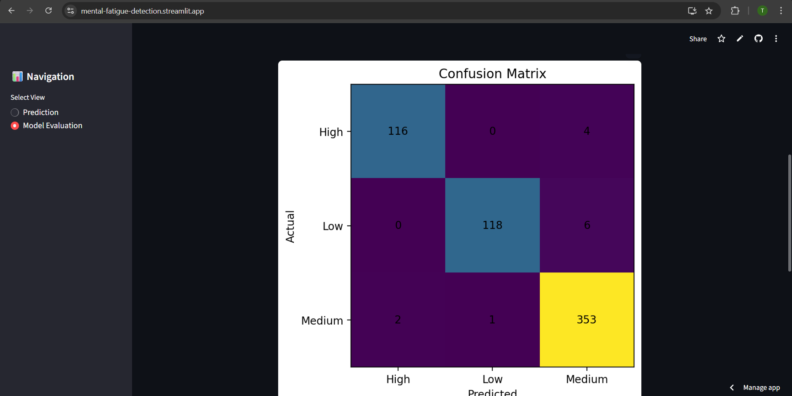
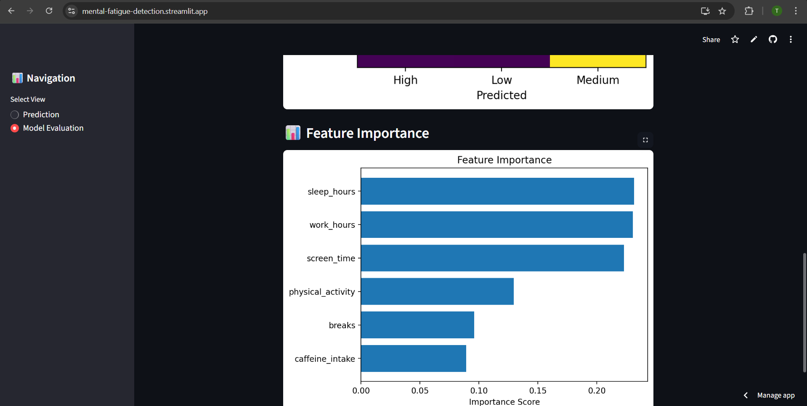

🧠 AI Mental Fatigue Detection System

A machine learning–powered web application that predicts mental fatigue levels (Low, Medium, High) using daily behavioral patterns such as sleep, screen time, work hours, physical activity, and caffeine intake.
The application also provides model evaluation metrics and visual insights to ensure transparency and interpretability.

🔗 Live App: https://mental-fatigue-detection.streamlit.app/

📌 Project Overview

Mental fatigue significantly impacts productivity, focus, and overall well-being.
This project demonstrates how machine learning can be applied to behavioral data to build an end-to-end, deployable AI system.

The system is:

Beginner-friendly

Professionally structured

Suitable for learning, portfolios, and interviews

🎯 Key Features

✅ Predicts mental fatigue level: Low / Medium / High

📊 Displays fatigue score (confidence-based)

🧠 Provides explainable insights based on user inputs

📈 Shows model evaluation metrics

🔢 Visualizes confusion matrix

📊 Displays feature importance

🌐 Fully deployed on Streamlit Cloud

🛠️ Tech Stack

Programming Language: Python

Machine Learning: Scikit-learn (Random Forest Classifier)

Data Handling: Pandas, NumPy

Visualization: Matplotlib

Web Framework: Streamlit

Model Persistence: Joblib

Deployment: Streamlit Cloud

📂 Project Structure
mental-fatigue-detection/
│
├── app.py # Streamlit web application
├── train_model.py # Model training & evaluation
├── generate_dataset.py # Synthetic dataset generator
├── requirements.txt # Project dependencies
├── README.md # Project documentation
│
├── data/
│ └── fatigue_data.csv # Realistic synthetic dataset (600+ rows)
│
├── model/
│ ├── fatigue_model.pkl # Trained ML model
│ ├── label_encoder.pkl # Label encoder
│ ├── evaluation_report.txt # Accuracy & classification report
│ └── feature_importance.csv # Feature importance values
│
├── screenshots/
│ ├── home.png
│ ├── prediction.png
│ ├── evaluation.png
│ └── feature_importance.png

📊 Dataset Description

The dataset is synthetically generated using rule-based logic to simulate realistic human behavior.

Contains 600+ samples

Features:

Sleep hours

Screen time

Work/study hours

Break frequency

Physical activity

Caffeine intake

Target Variable:

fatigue_level → Low / Medium / High

⚠️ Synthetic datasets are commonly used in academic and learning projects when real-world data is unavailable.

🧠 Machine Learning Approach

Problem Type: Multi-class Classification

Model Used: Random Forest Classifier

Why Random Forest?

Handles non-linear relationships well

Robust to noise

Provides feature importance for interpretability

📈 Model Evaluation

The model is evaluated using:

Accuracy

Precision, Recall, F1-score

Confusion Matrix

Evaluation results are:

Printed during training

Saved in evaluation_report.txt

Visualized directly inside the Streamlit app

This ensures transparent and explainable ML behavior, not just predictions.

🌐 Web Application (Streamlit)

The application provides two main views:

🔹 Prediction View

User inputs daily habits

App predicts fatigue level

Displays fatigue score and recommendations

🔹 Model Evaluation View

Classification report

Confusion matrix visualization

Feature importance chart

📸 Application Screenshots

  
  

  
  

  <b>Real screenshots from the deployed Streamlit application</b>

🚀 Deployment

The application is deployed on Streamlit Cloud, making it accessible without any local setup.

🔗 Live URL:
👉 https://mental-fatigue-detection.streamlit.app/

▶️ How to Run Locally

# Clone the repository

git clone https://github.com/OfficialTanishGupta/mental-fatigue-detection.git

# Navigate to project folder

cd mental-fatigue-detection

# Create virtual environment

python -m venv venv

# Activate environment (Windows)

venv\Scripts\activate

# Install dependencies

pip install -r requirements.txt

# Run the app

streamlit run app.py

🧪 Future Improvements

Integrate real-world datasets

Time-series fatigue tracking

User authentication & history

Advanced visualizations

Mobile-friendly UI

👤 Author

Tanish Gupta
CSE Graduate | AI/ML Enthusiast

🔗 GitHub: https://github.com/OfficialTanishGupta

🔗 Live App: https://mental-fatigue-detection.streamlit.app/

⭐ Final Note

This project demonstrates:

End-to-end ML workflow

Model evaluation & interpretability

Clean deployment

Practical application of AI in daily life

If you like this project, feel free to ⭐ the repository!
